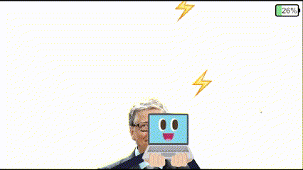

# OhMyComputer!

## 프로젝트 개요
**OhMyComputer!**는 Unity 2022.3.50f1 (LTS)으로 개발된 2D 캐주얼 게임으로, 물을 피하며 노트북의 배터리를 충전하는 독특한 콘셉트와 **B급 감성**이 특징입니다.

---

## 게임 플레이

---

## 게임 정보
- **장르:** 캐주얼 액션
- **플랫폼:** PC (Unity 기반)
- **개발 환경:**
  - Unity Hub 3.10.0
  - Unity 2022.3.50f1 (LTS)
  - 2D (Built-In Render Pipeline) v7.0.3

---

## 게임 목표 및 규칙

### 게임 목표
- 배터리를 100%로 충전하여 게임을 클리어합니다.
- 배터리가 0%가 되면 게임이 종료됩니다.

### 게임 규칙
1. **배터리 시스템**
   - 배터리는 시간이 지날수록 감소합니다.
   - 떨어지는 전기를 획득하면 배터리가 충전됩니다.
   - 배터리 잔량은 화면 우측 상단에 표시됩니다.
2. **아이템**
   - **전기:** 배터리를 충전합니다.
   - **물:** 접촉 시 즉시 게임이 종료됩니다.
3. **조작 방식**
   - 마우스를 드래그하여 캐릭터를 이동시킵니다.
   - 캐릭터가 화면 가장자리와 충돌하면 반대 방향으로 튕깁니다.

---

## 팀원 기여
|      김호탁       |       오정현      |       이연주     |
| :-------------: | :-------------: | :-------------: |
|   [@kimhotac](https://github.com/kimhotac)   |   [@dhwjdgus](https://github.com/dhwjdgus)   |   [@yeonj-u](https://github.com/yeonj-u)   |
| 한경대 컴퓨터공학과 sc | 한경대 컴퓨터공학과 sc | 한경대 컴퓨터공학과 sc |

---

## 주요 기능
1. **배터리 시스템**
   - 배터리 감소: 매 초 1씩 감소
   - 배터리 충전: 전기 획득 시 4씩 증가
   - UI 레이어링 방식으로 배터리 잔량 시각화
2. **아이템 및 애니메이션**
   - 전기 및 물의 낙하 확률과 속도를 기반으로 난이도 조정
   - 캐릭터 이동 및 정지 상태를 반영한 애니메이션
3. **레벨 디자인**
   - 배터리 잔량에 따라 게임 난이도 동적 변경